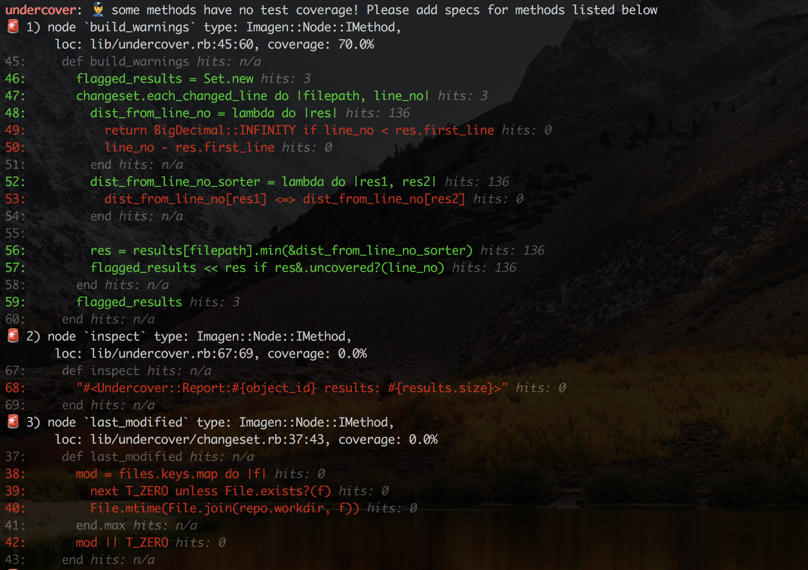

# undercover 👮‍♂️

**RuboCop for code coverage**

Meaningful warnings for methods and classes which lack testing, using data from coverage reports, git metadata and a parsed structure of your Ruby codebase. `undercover` automates the coverage feedback loop and makes sure no code review passes without tests.

A sample output of `undercover` ran before a commit may look like this:



And like this, given that specs were added:


The project is in an early phase, so please expect the unexpected and [report any problems or feedback as issues](https://github.com/grodowski/undercover/issues).

[](https://travis-ci.org/grodowski/undercover)
[](https://codeclimate.com/github/grodowski/undercover/maintainability)
[](https://codebeat.co/projects/github-com-grodowski-undercover-master)

## Installation

Add this line to your application's Gemfile:

```ruby
gem 'undercover'
```

And then execute:

    $ bundle

Or install it yourself as:

    $ gem install undercover

## Setting up required LCOV reporting

Undercover depends on a git diff, code structure generated by [`imagen`](https://github.com/grodowski/imagen_rb) and a coverage report in LCOV format.

To make your specs compatible with `undercover` by providing an LCOV report, please add `simplecov` and `simplecov-lcov` to your test setup. Example for rspec:

```ruby
# Gemfile
group :test do
  gem 'simplecov'
  gem 'simplecov-lcov'
end

# the very top of spec_helper.rb
require 'simplecov'
require 'simplecov-lcov'
SimpleCov::Formatter::LcovFormatter.config.report_with_single_file = true
SimpleCov.formatter = SimpleCov::Formatter::LcovFormatter
SimpleCov.start do
  add_filter(/^\/spec\//)
end

require 'undercover'

# ...
```

## Usage

### Compare method and class coverage with latest commit

```sh
undercover
```

### Compare with branch/ref

Undercover will list all methods and classes that haven't been covered in specs and have been added since a given git `ref`. Use the `-c --compare ref` flag to specify a git ref (commit hash, branch name, tag) to compare against.

**This is a recommended usage for CI/CD build environments**, as `undercover` will `exit 1` if there are any warnings.

```sh
undercover --compare master
```

### Options

```sh
undercover -h
Usage: undercover [options]
    -l, --lcov path                  LCOV report file path
    -p, --path path                  Project directory
    -g, --git-dir dir                Override `.git` with a custom directory
    -c, --compare ref                Generate coverage warnings for all changes after `ref`
    -h, --help                       Prints this help
        --version                    Show version
```

The defaults assume that the program is run from the top level of the project directory.

## Development

After checking out the repo, run `bin/setup` to install dependencies. Then, run `rake spec` to run the tests. You can also run `bin/console` for an interactive prompt that will allow you to experiment.

To install this gem onto your local machine, run `bundle exec rake install`. To release a new version, update the version number in `version.rb`, and then run `bundle exec rake release`, which will create a git tag for the version, push git commits and tags, and push the `.gem` file to [rubygems.org](https://rubygems.org).

## Contributing

Bug reports and pull requests are welcome on GitHub at https://github.com/grodowski/undercover.

## License

The gem is available as open source under the terms of the [MIT License](https://opensource.org/licenses/MIT).
